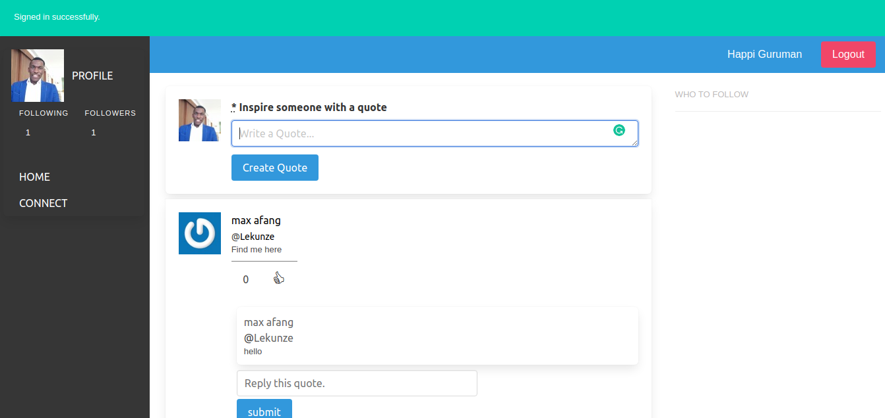
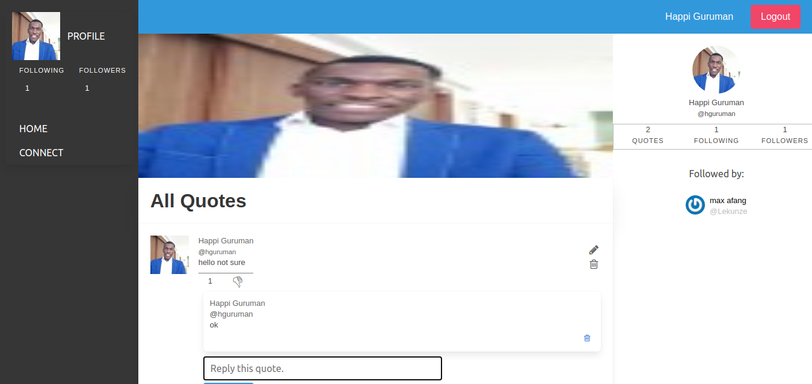
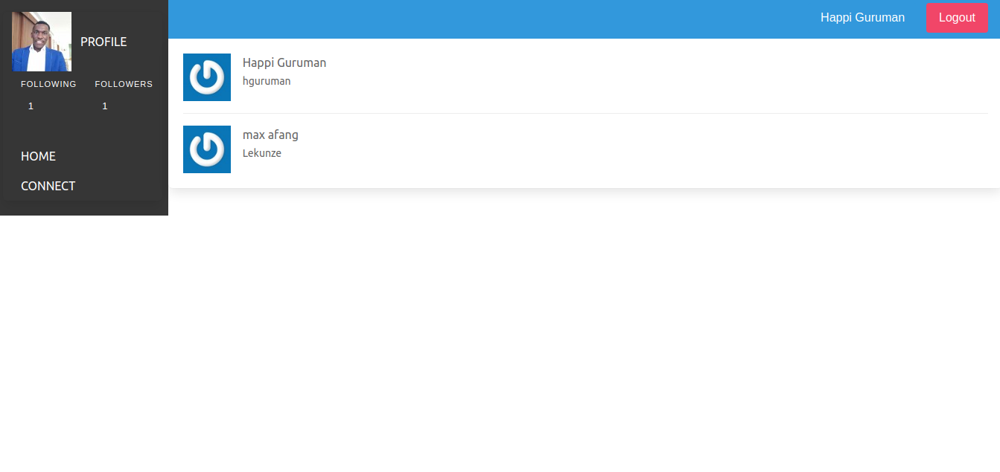

# Twitter Redesign Application (Inspirational Quotes App)
Inspirational Quotes Application built with Ruby on Rails

In this project we built an exclusive Inspirational Quotes App where users post inspirational quotes, the quotes can be liked, and users can be followed.

This project was built with:

- Ruby. v2.7.0
- Ruby on Rails v6.0.3.3
- Rubocop Linters
- Bootstrap
- RSpec
- Capybara
- Devise

## 🛠 Getting Started
## Install 
In order to run, you need to install Ruby in your computer. For windows you can go to [Ruby installer](https://rubyinstaller.org/) and for MAC and LINUX you can go to [Ruby official site](https://www.ruby-lang.org/en/downloads/) for intructions on how to intall it.

## Run the application
To get a local copy up and running follow these simple steps.

- Open a terminal
- Clone this repo using: `git clone "https://github.com/happiguru/twitter-redesign"`
- Run this command to install the necessary gems: `bundle install`
- Run the migrations with this code: `rails db:migrate`
- Run a localserver using: `rails server`

## Open app in browser

- When the program is running go to your browser
- put: localhost:3000/
- Click on login, register and Sign up as a new member
- Enjoy the app

## ✒️ Authors

👤 **Stanley Enow Lekunze**

- Github: [@happiguru](https://github.com/happiguru)
- LinkedIn:[LinkedIn](https://www.linkedin.com/in/lekunze-nley)

## 🤝 Contributing
Contributions, issues and feature requests are welcome!

Feel free to check the [issues page](https://github.com/happiguru/twitter-redesign/issues).

## 📝 License
This project is [MIT](lic.url) licensed.